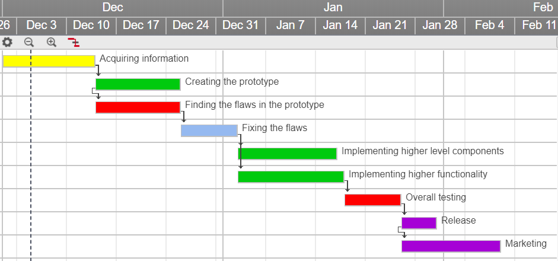

# 1.3 S/T methodology and associated work plan

First thing we want to do is to acquire information from the general public. We want to know what the people want - we have ideas of our own, but we want to please our customers as much as possible. We want to see their reactions to our ideas and hear their own. We plan on spending at least a week on this part.

Next, we will create a functioning prototype. It will have some basic functionalities like sensors used for moving around, vacuuming and so on. It will also have the ability to detect whether other surfaces, that the current version isn't capable of scanning, need to be cleaned. Another week should be more than enough for our team to finish this step.

During the creation of the prototype, we will be conducting thorough testing in order to find the flaws with our base operations, since if they aren't working properly - nothing is.  
Of course, nothing is made perfect, so after the tests, we have to fix all the issues we found. The duration of this step may vary, due to the amount of issues found.

After we are certain our base operations are working well, we are going to add the higher level components. We are also going to improve the quality of existing components. We plan to spend around ten days on this bit.

At the same time, the programmers of our team are going to be implementing all the higher functionalities we, and the community, had in mind. After this step, we will have a finished product, that is an improved version of the existing one. Our team might be small but they are highly skilled - so ten days should be more than enough for them to implement everything.

Following the completion of the product, there is another set of thorough tests. We want to be sure that everything is working properly and that our product doesn't represent any danger to our consumers. We will take a week to conduct these tests.

We wrap everything up by releasing our product. This shouldn't take more than 3 days. The release is followed by dissemination - it will start immediately after the beginning of the release stage. Advanced marketing will take place the first few weeks after the release and after that, we will conduct regular marketing, mostly through ads on the internet, indefinitely.

| Work package no. | Work package title | Type of activity| Lead partic. no. | Lead partic. short name | Person-months | Start month | End month |
|:---:|:---:|:---:|:---:|:---:|:---:|:---:|:---:|
| 1 | Acquiring information  | RTD |  |  | 0.2 | 1 | 1 |
| 2 | Creating the prototype | DEM |  |  | 0.4  | 1 | 1 |
| 3 | Finding the flaws | RTD |  |  | 0.4 | 1 | 1 |
| 4 | Fixing the flaws | RTD |  |  | 0.4 | 1 | 1 |
| 5 | Implementing components | RTD |  |  | 0.5 | 1 | 2 |
| 6 | Implementing functionality | RTD |  |  | 0.5 | 1 | 2 |
| 7 | Overall testing | DEM |  |  | 0.3 | 2 | 2 |
| 8 | Release | DEM |  |  | 0.2 | 2 | 2 |
| 9 | Marketing | DEM |  |  | 1 | 2 | 3 |

